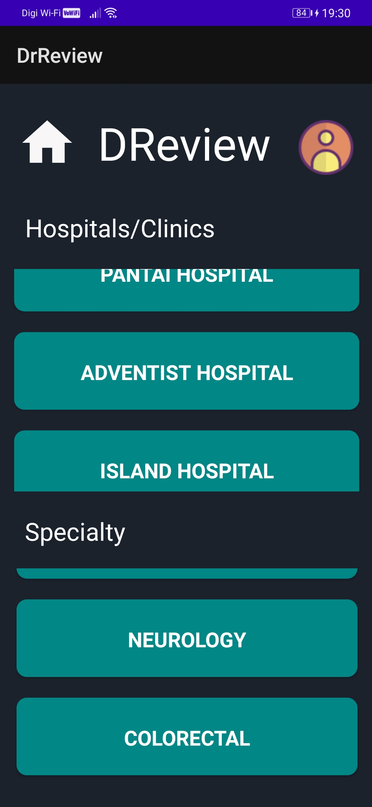
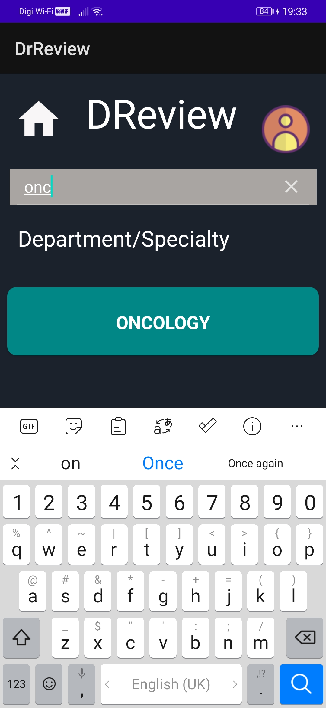
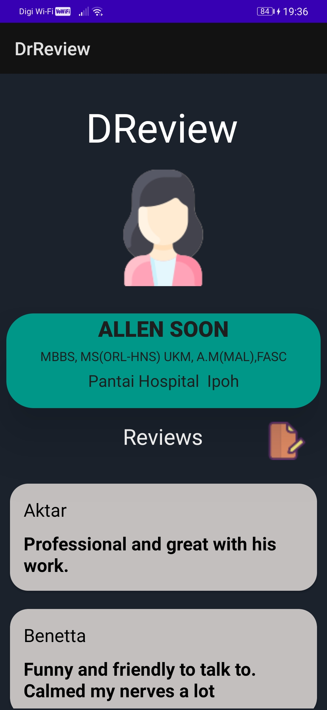
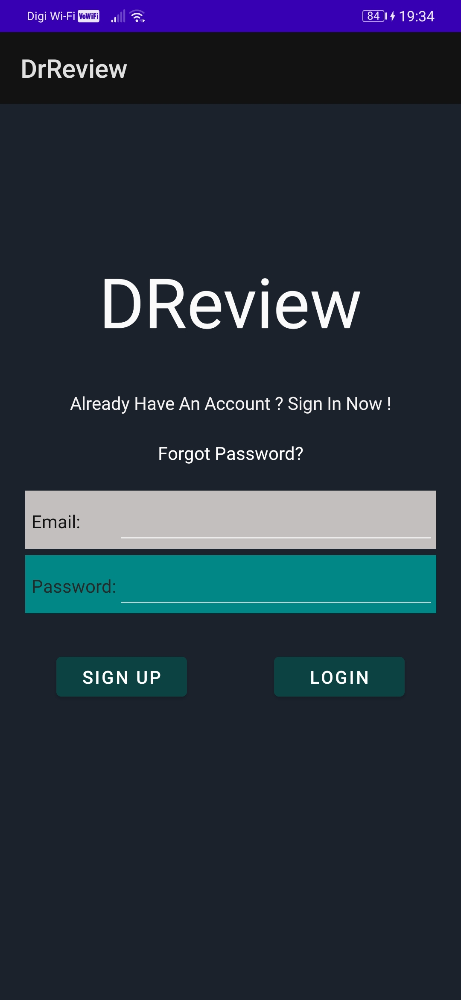
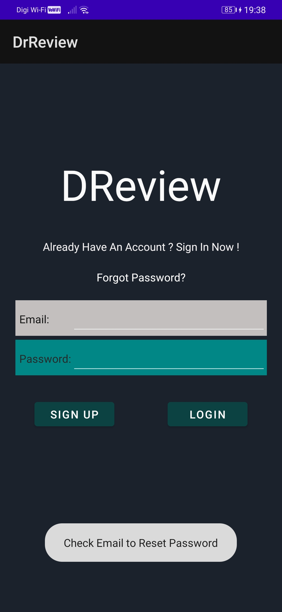

# DrReview
Project done for Mobile Device Programming module. An app where users can look up doctors around the area and rate/ view the ratings of the physicians

## A Quick Glimpse

1. Database - Firebase
2. Framework - Andriod Studio

### Note: Have not yet updated the feature where locations can be used to narrow search
---
## Some ScreenShots

